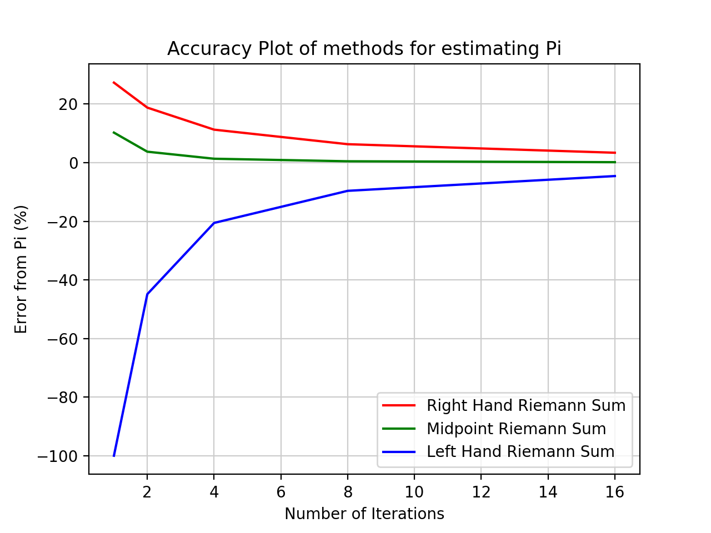
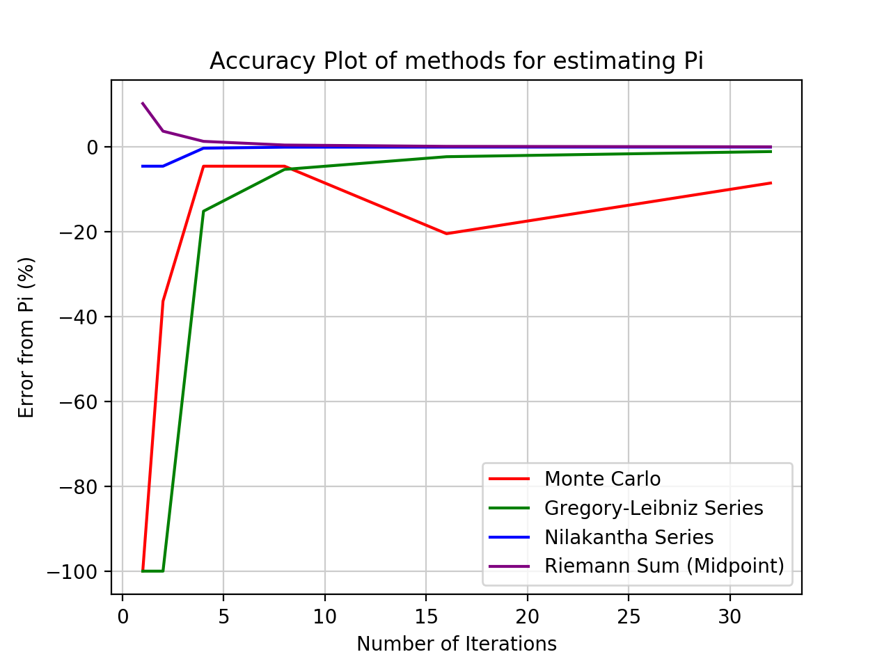
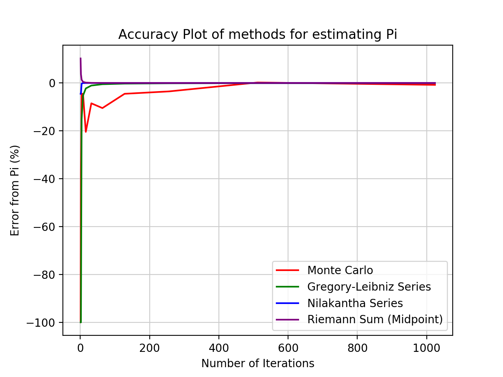

# Estimating Pi with Computation

by Rushil A.

[toc]

## Outline

In this mini-project I'll be using a set of methods and computation in order to approximate the value of the mathematical constant $\pi$.

The specific methods I’ll be using are:

- Gregory-Leibniz series
- Nilakantha series
- Monte Carlo method


## Theory

### Gregory-Leibniz Series

This is often called the *Leibniz formula for $\pi$*, and it states that that:
$$
\pi = 4\left(1-\frac{1}{3}+\frac{1}{5}-\frac{1}{7}+\frac{1}{9}-\cdots\right)
$$

#### Derivation

The Leibniz formula comes from the power series of the inverse tangent function, commonly known as “*Gregory’s series*”.
The derivation for this formula can all be done with only A-Level Mathematics techniques.

##### Gregory’s Series

*(For the exact purpose of this paper, this part of the derivation can be skipped but is certainly a nice piece of mathematics)*

Consider $arctan(x)$
$$
\frac{d}{dx}\left(arctan(x)\right)=\frac{1}{1+x^2}\\
\therefore arctan(x)=\int\left(\frac{1}{1+x^2}\right)dx\\
$$
The Binomial series can be given as:


Substituting $-x$ into the above expansion, we get the following result:
$$
(1+(-x))^{-1} = 1 + (-1)(-x) + \frac{(-1)(-2)}{2!}(-x)^2 + \frac{(-1)(-2)(-3)}{3!}(-x)^3 + \cdots\\
(1-x)^{-1}=1+x+x^2+x^3+\cdots\\
\therefore \frac{1}{1-x}=1+x+x^2+x^3+\cdots \text{, }|x|<1
$$
(We can also get to this result by considering an infinite Geometric Progression with first term $1$ and common ratio $x$ where $|x|<1$).

Substituting $-x^2$ into the above result, we get a power series for $arctan(x)$:
$$
arctan(x)=\int\left(\frac{1}{1-(-x^2)}\right)dx\\
=\int\left(1+(-x^2)+(-x^2)^2+(-x^2)^3+\cdots\right)dx\text{, }|x^2|<1\\
=\int\left(1-x^2+x^4-x^6+\cdots\right)dx\text{, }|x^2|<1\\
=x-\frac{x^3}{3}+\frac{x^5}{5}-\frac{x^7}{7}+\cdots+c\text{, }|x^2|<1\\
$$
To find $c$, let $x=0$:
$$
arctan(0)=c+0+\frac{0^3}{3}+\frac{0^5}{5}+\frac{0^7}{7}+\cdots\\
0=c\\
arctan(x) = x-\frac{x^3}{3}+\frac{x^5}{5}-\frac{x^7}{7}+\cdots\text{, }|x^2|<1\\
$$
Consider the restriction $|x^2|<1$
$$
|x \times x| < 1\\
|x| \times |x| < 1 \text{ (} \because |ab|=|a||b| \text{)}\\
|x|^2 < 1\\
\sqrt{|x|^2} < \sqrt{1}\\
\therefore |x|<1
$$
So our final power series is:
$$
\therefore arctan(x) = x-\frac{x^3}{3}+\frac{x^5}{5}-\frac{x^7}{7}+\cdots\text{, }|x|<1\\
$$
This can also be written as a sum for conciseness:
$$
arctan(x) = \sum_{r=0}^{\infty}\left(\frac{(-1)^r}{2r+1}x^{2r+1}\right)
$$

##### Leibniz Formula for $\pi$

Since $tan(\frac{\pi}{4})=1$, $arctan(1)=\frac{\pi}{4}$
$$
\pi = 4\left(arctan(1)\right)\\
\pi = 4\left(1-\frac{1^3}{3}+\frac{1^5}{5}-\frac{1^7}{7}+\frac{1^9}{9}-\cdots\right)\\
\therefore \pi = 4\left(1-\frac{1}{3}+\frac{1}{5}-\frac{1}{7}+\frac{1}{9}-\cdots\right)\\
\therefore \pi = \frac{4}{1}-\frac{4}{3}+\frac{4}{5}-\frac{4}{7}+\frac{4}{9}-\cdots
$$
This can be written as a sum of sums for pragmatic convenience.
One form is as such:
$$
\pi \approx \sum_{r=1}^{\lfloor{\frac{n}{2}}\rfloor}\left(\frac{4}{4r-3}\right) - \sum_{r=1}^{n-\lfloor{\frac{n}{2}}\rfloor}\left(\frac{4}{4r-1}\right)
$$
Here, I am taking $n$ as the final term in iteration (since computationally we cannot fully evaluate sums to infinity).
Of course, the larger this value of $n$, the better the approximation of $\pi$ since there are more terms.


### Nilakantha Series

This series is given as:

$$
{\displaystyle \pi =3+{\frac {4}{2\times 3\times 4}}-{\frac {4}{4\times 5\times 6}}+{\frac {4}{6\times 7\times 8}}-{\frac {4}{8\times 9\times 10}}+\cdots }
$$

It is often known as the ‘accelerated’ series for $\pi$.

#### Derivation

The derivation will not be discussed in this paper, but one such example is available [here](https://www.researchgate.net/publication/283579663_Nilakantha's_accelerated_series_for_pi).

However, I will rewrite the above series as a sum of sums for pragmatic convenience.
One form is as such:
$$
\pi \approx 3+\sum_{r=1}^{\lfloor{\frac{n}{2}}\rfloor}\left(\frac{4}{(4r-2)(4r-1)(4r)}\right) - \sum_{r=1}^{n-\lfloor{\frac{n}{2}}\rfloor}\left(\frac{4}{(4r)(4r+1)(4r+2)}\right)
$$
Again, the larger this value of $n$, the better the approximation of $\pi$ as there are more terms.


### Riemann Sum

This method is used in order to approximate integrals, and works by taking a finite sum of rectangles at regular intervals along a continuous function.

#### Derivation

In order to use a Riemann sum to approximate $\pi$, we consider a Unit Circle, similar to the setup for the Monte Carlo method above. If we consider the upper right quadrant, we get a sector of this circle from $0\leq x \leq 1$.


Since the equation of this circle is $x^2+y^2=1$, we can rearrange for a form in $f(x)$ as $y=\sqrt{1-x^2}$. Integrating between the bounds $x=0$ and $x=1$ gives the area of this sector.

The area of the unit circle is $\pi$ so this sector will have an area of $\frac{\pi}{4}$.

We construct rectangles underneath the arc as shown below. The more rectangles we use, the better the approximation of the area.


### Monte Carlo Method

Monte Carlo methods are a broad class of computational algorithms that rely on repeated random sampling to obtain numerical results.
The underlying concept is to use randomness to solve problems that might be deterministic in principle.

#### Derivation

We begin by considering the Unit Circle (centre at the origin and radius 1) enclosed in a square (centre at the origin and side length 2).

Area of circle, $A_c=\pi r^2=\pi(1)^2=\pi$
Area of square, $A_s=2 \times 2=4$

The ratio between the area of the circle and square can be given as such:
$$
\frac{A_c}{A_s}=\frac{\pi}{4}\\
\therefore \pi=\frac{4 \times A_c}{A_s}
$$
The idea now is to simulate uniformly distributed random $(x, y)$ points in a 2D plane between the points $(-1, -1)$ and $(1, 1)$.
We then calculate the ratio of number points that lied inside the circle and total number of generated points.

So, for a very large number of points:
$$
\frac{4 \times A_c}{A_s}\approx4\times\frac{\text{no. of points generated inside the circle}}{\text{no. of points generated inside the square}}
$$
In order to calculate which points generated lie inside the circle, we can simply use the distance from origin with the formula $\sqrt{x^2+y^2}$.
If $\sqrt{x^2+y^2}\leq1$, then the point lies inside the circle. Otherwise, the point does not lie in the circle.
Because of our choice of domain, all points generated will lie inside the square.

In randomised and simulation algorithms like Monte Carlo, the more the number of iterations, the more accurate the result is.
Thus, the title is “**Estimating** the value of Pi” and not “Calculating the value of Pi”.


## Implementation

I am implementing these in Python programs for ease of understanding rather than computational efficiency or runtime speed.

There are likely much better ways to implement these in code, but all of them work as intended and are easy to understand.

### Gregory-Leibniz Series

We take from previous our sum of sums form:
$$
\pi \approx \sum_{r=1}^{\lfloor{\frac{n}{2}}\rfloor}\left(\frac{4}{4r-3}\right) - \sum_{r=1}^{n-\lfloor{\frac{n}{2}}\rfloor}\left(\frac{4}{4r-1}\right)
$$
Now I will construct a function, where `n` is the number of iterations (and hence terms) to be made with this series.

```python
def est_pi_gl(n):
    # Gregory-Leibniz Series
    pi_est = 0
    
    for i in range(1, n//2):
        pi_est += 4/(4*i - 3)

    for i in range(1, n-n//2):
        pi_est -= 4/(4*i - 1)
    
    return pi_est
```

Note that I am using the integer division operator `//` to correspond to the flooring of $\frac{n}{2}$ in the sum bounds.

Computationally, this algorithm has a complexity of $\mathcal{O}(n)$ as there is only one layer of nesting with the iteration blocks.

Running this function with `n=10` yields $\pi \approx$`3.0170718170718174`


### Nilakantha Series

We take from previous our sum of sums form:
$$
\pi \approx 3+\sum_{r=1}^{\lfloor{\frac{n}{2}}\rfloor}\left(\frac{4}{(4r-2)(4r-1)(4r)}\right) - \sum_{r=1}^{n-\lfloor{\frac{n}{2}}\rfloor}\left(\frac{4}{(4r)(4r+1)(4r+2)}\right)
$$
Now I will construct a function, where `n` is the number of iterations (and hence terms) to be made with this series.

```python
def est_pi_ni(n):
    # Nikolantha Series
    pi_est = 3
    cur = 2

    for i in range(1, n//2):
        cur = 4*i-2
        pi_est += 4/(cur*(cur+1)*(cur+2))

    for i in range(1, n-n//2):
        cur = 4*i
        pi_est -= 4/(cur*(cur+1)*(cur+2))

    return pi_est
```

Note that I am using the integer division operator `//` to correspond to the flooring of $\frac{n}{2}$ in the sum bounds.

Computationally, this algorithm has a complexity of $\mathcal{O}(n)$ as there is only one layer of nesting with the iteration blocks.

Running this function with `n=10` yields $\pi \approx$`3.1412548236077646`


### Riemann Sum

There are three types of Riemann Sums.

Right Hand: $A=\frac{b-a}{n}\left[f(x_1)+f(x_2)+f(x_3)+\ldots+f(x_n)\right]$

Left Hand: $A=\frac{b-a}{n}\left[f(x_0)+f(x_1)+f(x_2)+\ldots+f(x_{n-1})\right]$

Central: $A=\frac{b-a}{n}\left[f(x_0.5)+f(x_1.5)+f(x_2.5)+\ldots+f(x_{\frac{n-1}{2}})\right]$

Now I will construct a function, where `n` is the number of rectangles to be used for the sum and the `mode` defines which type of sum is used.

```python
def est_pi_rm(n, mode="right"):
    # Riemann Sum
    pi_est = 0

    delta_x = 1 / n
    if mode == "right":
        x = 0
    elif mode == "left":
        x = delta_x
    elif mode == "centre":
        x = delta_x/2

    while x < 1:
        f_x = math.sqrt(1 - math.pow(x, 2))
        pi_est += f_x * delta_x
        x += delta_x
    return 4 * pi_est
```

Running this function with `n=10` yields $\pi \approx$`3.152411433261645`

Since the arc described in the theory is a decreasing curve in this domain, the Right Hand Sum will be an overestimate and the Left Hand Sum an underestimate. We can verify this by plotting the % error by n for each type of sum:




### Monte Carlo Method

In order to emulate the production of uniformly distributed random variables, I will be using Python’s `random` library.
In particular, the `uniform()` function.

> `random.uniform(a, b)`:
>
> Return a random floating point number *N* such that `a <= N <= b` for `a <= b` and `b <= N <= a` for `b < a`.
> The end-point value `b` may or may not be included in the range depending on floating-point rounding in the equation `a + (b-a) * random()`.
>
> ([Source](https://docs.python.org/3/library/random.html#random.uniform) - Python Docs)

I also use the `math` library from Python to get a more precise square root value for the in/out of circle check.

```python
def est_pi_mc(n):
    random.seed(0)
    pts_in_circle = 0

    for _ in range(n):
        x = random.uniform(0, 1)
        y = random.uniform(0, 1)

        if math.sqrt(x**2 + y**2) < 1:
            pts_in_circle += 1

    return 4 * pts_in_circle / n
```

Note that I said **emulate the production of** rather than “produce”. This is because Python’s `random` library does not generate truly random values, but rather utilises a Pseudo-random number generator. Specifically, Python’s `random` library uses a PRNG called the *Mersenne Twister*. [Here](https://www.youtube.com/watch?v=_tN2ev3hO14) is an introduction to PRNGs and how the Mersenne Twister works under the hood.

Line 2, `random.seed(0)` ’seeds’ the Mersenne Twister generator and therefore allows me to obtain repeatable results for each program’s run.

I can plot the circle, square and the generated points to visualise the algorithm in action.

For example, here I generate 150 points (`n`= 150) and plot the ones that fall inside the circle as red spots and the ones outside the circle as blue spots:


In this particular example, 119 points fell in the circle (i.e. are dotted red) and 150 points were generated in total.

So this calculates $\pi \approx 4 \times \frac{119}{150}$ = `3.1733333333333333`.


## Convergence

### My Findings

In order to investigate the convergence of each of these algorithms, I plotted `n` against `% error from pi`.

For the Riemann Sum, I used the Midpoint Sum because from the plot above, that had the fastest convergence, and this is a comparison of performance.

Below are those plots at three different ranges of `n`, to better analyse what convergence is like in the short, medium and long term.

#### `n: 1 -> 32`



This short term convergence between the two series is quite predictable as the Gregory-Leibniz Series starts at a value of $4$ while the Nilakantha series begins at $3$ which is clearly far closer to $\pi$ than $4$. This property confirms that the Nilakantha series is ‘accelerated’.

The Gregory-Leibniz Series also seems to exhibit logarithmic convergence. Nilakantha’s convergence is not easy to see, but it is very fast.

The Monte Carlo method is also explainable in that a very small number of random points will cause massively different values since the possible values reachable by any configuration of generated points will be very erratic.
Hence, we see that it is very disorderly compared to the other two.

The Riemann Sum seems to be converging exponentially as well, at a similar rate to the Nilakantha series.


#### `n: 1 -> 128`


By this point, both series have converged very close to zero with only a few % error, while the Monte Carlo series is still being very erratic and has an error around 10 to 15%.

The Gregory-Leibniz Series seems to still be continuing with this logarithmic convergence.
The Nilakantha Series and the Midpoint Riemann Sum both have negligible error at these values of `n`.


#### `n: 1 -> 1024`



It seems at the longer term that by about 500 points, the Monte Carlo method is showing some promise despite diverging slightly even beyond 800 points.

Both series and the sum have negligible error by this point.


### Further Investigation

Looking at the Wikipedia page for the Leibniz formula, and more specifically the “Convergence” section:

> 
>

They also have their own more thorough plots for convergence, where they compare other series methods that I have not considered here.

> 
>
> Comparison of the convergence of several historical infinite series for π. Sn is the approximation of after taking n terms. Each subsequent subplot horizontally magnifies the shaded area by 10 times. The lines are merely to connect points of each series; there are no intermediate values between terms.

These align with my findings from the plots, that the Gregory-Leibniz Series is far slower to converge than the Nilakantha Series.

We can also see the ‘alternating’ property of both series, as on the rightmost plot from Wikipedia they both seem to oscillate about pi, gradually reducing in distance away from pi.

The paper referenced above with the derivation of the Nilakantha Series also states that:

> 

This also confirms my hypothesis that there is a logarithmic convergence across both alternating series.

As for Monte Carlo, there is not much comparison to make between that method and the series since they are fundamentally different and the Monte Carlo model is based off randomness and statistics rather than pure mathematics. It was interesting however to see how they did compare, and that eventually the Monte Carlo method did seem to converge for large numbers of points.


## Discussion Points

- I’d like to look into other, more sophisticated and modern algorithms to finding Pi, especially those with very fast convergence and see how they differ from the ones discussed here.
- It will be interesting to see where the Power series in the derivation of the Gregory-Leibniz method fits into the Further Maths content for Taylor and/or Maclaurin series.
- There are other Monte Carlo simulations that can be done to achieve the same, such as throwing sticks onto lines; perhaps I could try implementing those and compare different Monte Carlo methods for estimating Pi.
- We can actually try to do Monte Carlo methods in practicality, such as getting a dartboard on a square block and throwing many darts at it, and then estimating Pi depending on how many darts hit the board and how many do not. We can then see if throwing darts emulates randomness.


## Appendix

All source code is available in the following structure inside the `estimating-pi` repository.